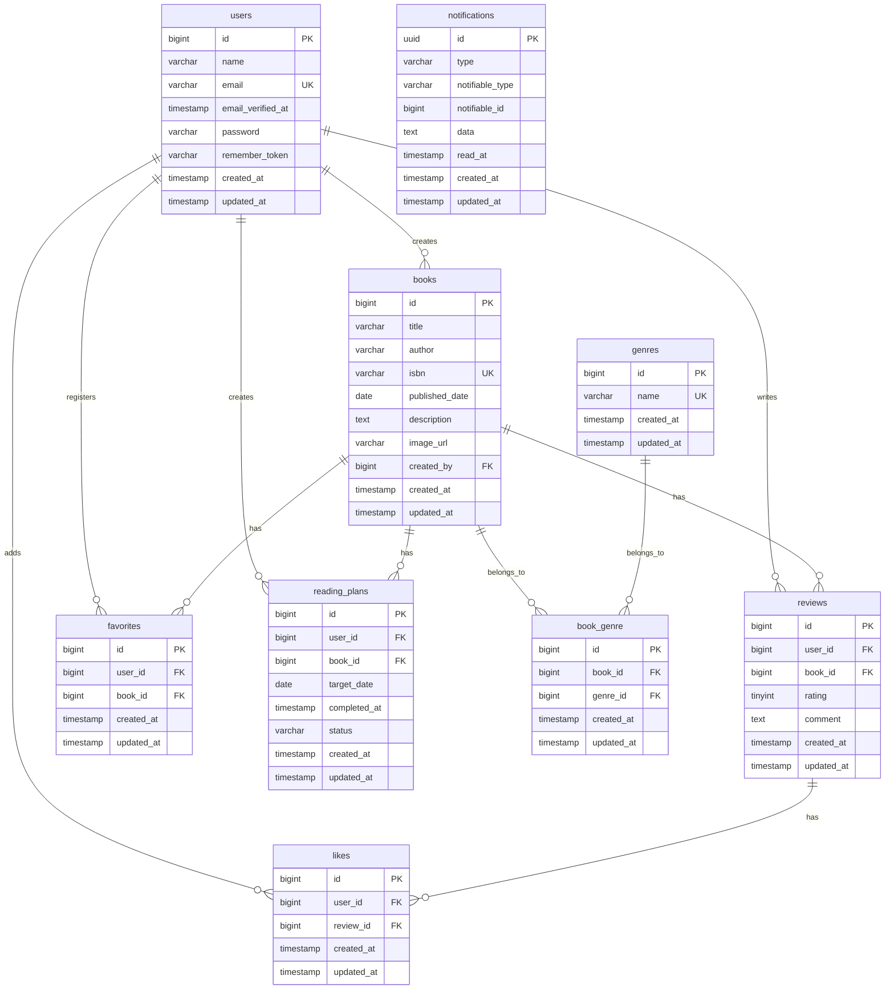

# Bookshelf App

Laravelを使用して開発した書籍管理アプリです。

書籍の登録・編集・削除、レビュー投稿、お気に入り、ランキング、読書計画、通知機能、Google Books APIによるISBN検索、REST APIなどを実装しています。

---

## 作成者

菅野 まりえ

---

## 使用技術

- PHP 8.2
- Laravel 10.x
- MySQL 8.0
- Nginx
- Docker / Docker Compose / Laravel Sail
- Laravel Fortify（認証）
- Laravel Sanctum（API認証）
- Google Books API
- PHPUnit
- phpMyAdmin

---

## ER図



### 主な制約

- `book_genre`：`book_id` と `genre_id` の複合ユニーク制約
- `favorites`：`user_id` と `book_id` の複合ユニーク制約
- `likes`：`user_id` と `review_id` の複合ユニーク制約
- `reading_plans.status`：`in_progress`・`completed`・`overdue`
- `reading_plans.completed_at`：読了前はNULL
- `notifications`：Laravel標準のポリモーフィック通知テーブル


---

# 開発環境URL

http://localhost

---

# 動作環境

- Docker
- Docker Compose

※WindowsではWSL2の利用を推奨しています。

---

# 環境構築手順

## 1. リポジトリをクローン

```bash
git clone <リポジトリURL>
```

## 2. .envを作成

```bash
cp .env.example .env
```

以下を設定してください。

```text
DB_CONNECTION=mysql
DB_HOST=mysql
DB_PORT=3306
DB_DATABASE=laravel
DB_USERNAME=sail
DB_PASSWORD=password

GOOGLE_BOOKS_API_KEY=あなたのAPIキー
```

---

## 3. Composerパッケージのインストール

```bash
docker run --rm \
-u "$(id -u):$(id -g)" \
-v "$(pwd):/var/www/html" \
-w /var/www/html \
laravelsail/php82-composer:latest \
composer install --ignore-platform-reqs
```

---

## 4. Sail起動

```bash
./vendor/bin/sail up -d
```

---

## 5. アプリケーションキー生成

```bash
sail artisan key:generate
```

---

## 6. マイグレーション・シーディング

```bash
sail artisan migrate:fresh --seed
```

---

## 7. Node Modulesインストール

```bash
sail npm install
```

---

## 8. フロントビルド

```bash
sail npm run build
```

---

## 9. アプリ起動

http://localhost

---

# テスト実行

通常

```bash
sail artisan test
```

カバレッジ付き

```bash
sail artisan test --coverage
```

---

# 主な機能

### 基本機能

- ユーザー登録
- ログイン
- ログアウト
- 書籍CRUD
- ジャンルCRUD
- レビューCRUD
- お気に入り
- レビューいいね
- ランキング表示

### 応用機能

- 読書計画CRUD
- 読了機能
- 通知一覧
- 日時バッチによる通知
- マイ読書レポート
- Google Books API連携
- Sanctum認証API

---

## 画面イメージ

### 書籍一覧


### 書籍詳細


### 読書計画一覧


### マイ読書レポート


### 通知一覧


---

## APIエンドポイント

### 認証

|　Method　|　URI　|　概要　|
|---|---|---|
| POST | /api/v1/login | ログイン・トークン発行 |
| POST | /api/v1/logout | ログアウト・トークン削除 |

### 書籍

|　Method　|　URI　|　概要　| 認証 |
|---|---|---|---|
| GET | /api/v1/books | 書籍一覧取得 | 不要 |
| GET | /api/v1/books/{book} | 書籍詳細取得 | 不要 |
| POST | /api/v1/books | 書籍登録 | Sanctum |
| PUT | /api/v1/books/{book} | 書籍更新 | Sanctum |
| DELETE | /api/v1/books/{book} | 書籍削除 | Sanctum |
